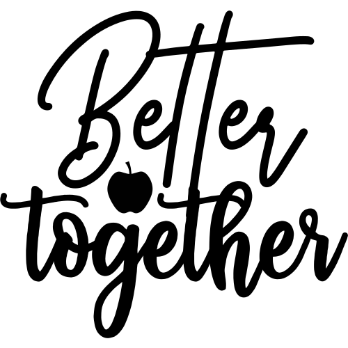
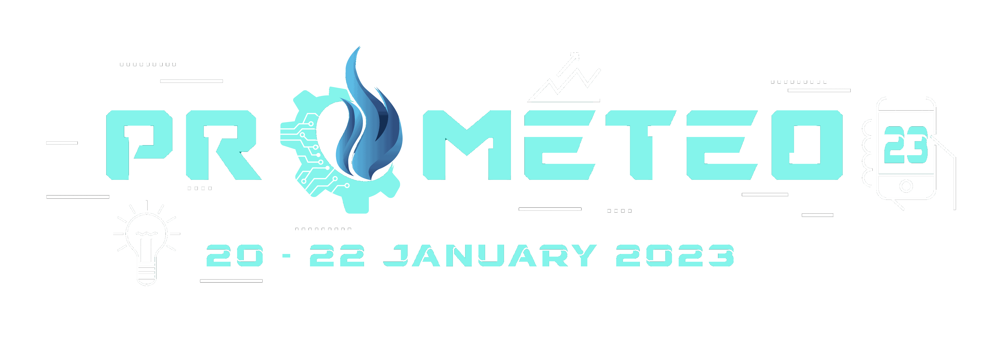

# ReCreate

## Problem Statement
<ul>
<li>
In today’s modern era, we are increasingly becoming more dependent on technology when making new friends and connecting with people we care about. We have essentially taken everything and turned it into an application. A significant side-effect of this digitization has been people drifting apart from their closest ones.The modern world is perceived as being unromantic since people would rather use messenger services to find a partner than start traditional dating.
</li>
<li>
However, they are not to blame because modern advancements in technology, an ever-increasing pace of life, and a shortage of free time lead people to look for practical solutions, even in the realm of romantic relationships.
</li>
<li>
A lucrative market for starting your own firm is developing apps for couples who are engaged, dating, in long-distance relationships, or who are already married.
</li>
<li>
There are different existing websites and apps spanning diverse ideas. Merging ideas also has become a popular choice these days, attracting more users. Therefore, innovative ideas have a great potential in the dating app sphere.
</li>
</ul>

## What we did?
We tried to develop a comprehensive solution to all of the aforementioned issues. A web application called <strong>Better Together</strong> was created for couples who are separated because of their careers or jobs. 
The application has a number of features that might help couples manage their time with one another while juggling work and personal obligations. Some of the suggested attributes include:
<ul>
<li>
<b>Haal Kaisa hai Janab ka?</b> - As soon as you sign up on our website, you are directed to a page where you are asked to provide your opinion on specific traits of your partner before going through the same process for yourself. Based on your review of your traits and those of your mate, we suggest activities of shared interest.
</li>
<li>
<b>We keep this love in a Photograph</b> - Our website will often automatically create photo collages and video compilations for special occasions that can then be downloaded and shared on social media accounts. This makes it easier for the user to recall their time together.
</li>
<li>
<b>Mere Dil ke Lifafe Mein</b> - Using this tool, a person can send a quick note of affection to their significant other. The recipient's webpage displays the note, which is shown for 24 hours before disappearing. This allows the user to carve out some time, as needed, to write a few words that express their affection.
</li>
<li>
<b>Suddenly My life turned around like a Movie</b> - Nowadays, there is so much hustle that it can be tough to carve out time for your partner. Even if they get to spend those hours together, a lot of time is lost choosing what movie or television show to watch. However, any partner can use this function to add a movie or series to a wishlist that they intend to watch together so that they can enjoy their viewing time rather than just making a choice. Additionally, it will provide recommendations based on their past watch habits.
</li>
<li>
<b>Aaj unse Milna hai Humein</b> - Couples can work together to set up a reminder for their date when they decide to meet up in person after days of restricted and virtual communication. The countdown starts as soon as the reminder is set up, and it will notify each user about their date after a predetermined number of days. The couples' shared memories and animated pop-ups would make this reminder appealing.
</li>
<li>
<b>Silver Lining to my Dark Cloud</b> - 
</li>
<li>
<b>Silver Lining to my Dark Cloud</b> - 
</li>
</ul>

## Project Information
This project is developed as a submission to Date-a-thon(Prometeo'23) by team Play Date

